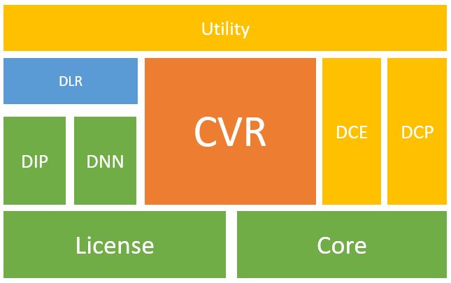

# SDK Overview: Modules and Main APIs

This page provides an overview of the various modules and highlights the most essential APIs that form the backbone of Dynamsoft Label Recognizer SDK.

## Modules Summary

The Dynamsoft Label Recognizer (DLR) SDK is built on the Dynamsoft Capture Vision (DCV) framework, which includes multiple modules working together to achieve text line recognition. The hierarchical structure diagram below illustrates the various modules of the DLR SDK (with modules at the top depending on those below).

    

    
Modules hierarchical of the DLR SDK

The table below describes details the functionalities of these modules:

| Module |Description | Mandatory/Optional|
|:--------|:------------|:---|
| `DynamsoftCaptureVisionRouter.xcframework`(CVR) | Provides APIs for single/multiple images processing, setting configurations, and other features. | Mandatory|
| `DynamsoftLabelRecognizer.xcframework`(DLR) | This library mainly provides label recognizing algorithms. It includes APIs for you to configure label recognizing settings and obtaining the text line recognition results. | Mandatory|
| `DynamsoftCore.xcframework`(Core) | Provides basic structures and intermediate result related APIs. | Mandatory|
| `DynamsoftImageProcessing.xcframework`(DIP) | This library mainly provides image processing algorithms. | Mandatory|
| `DynamsoftNeuralNetwork.xcframework`(DNN) | The library includes deep netural network algorithms. | Mandatory |
| `DynamsoftLicense.xcframework`(License) | Provides license activation or management APIs. | Mandatory|
| `DynamsoftCameraEnhancer.xcframework`(DCE) | The <a href="/camera-enhancer/docs/mobile/programming/ios/" target="_blank">Dynamsoft Camera Enhancer (DCE) SDK</a> provides camera control, camera enhancements, and basic UI configuration features. | Optional |
| `DynamsoftCodeParser.xcframework`(DCP) | The [Dynamsoft Code Parser (DCP) SDK]({{ site.dcp_ios }}){:target="_blank"} for parsing the result. You can use this library for processing the Driver's license or VIN. | Optional |
| `DynamsoftUtility.xcframework`(Utility) | The utility library, which includes multiple implementations of image source adapters, result filter, image exporter, and other utility APIs etc.  | Optional |

## Main APIs

### Capture Vision Router

The main class [`CaptureVisionRouter`]({{ site.dcv_ios_api }}capture-vision-router/capture-vision-router.html) acts as the SDK entry point and provides the following essential APIs:

- [Set input]({{ site.dcv_ios_api }}capture-vision-router/multiple-file-processing.html#setinput)
- [Config Label Recognizer settings]({{ site.dcv_ios_api }}capture-vision-router/settings.html)
- [Add result receiver]({{ site.dcv_ios_api }}capture-vision-router/multiple-file-processing.html#addresultreceiver)
- [Start video stream text recognizing]({{ site.dcv_ios_api }}capture-vision-router/multiple-file-processing.html#startcapturing)

### Image Source Adapter

The [`ImageSourceAdapter`]({{ site.dcv_ios_api }}core/basic-structures/image-source-adapter.html) class is an abstract class representing an adapter for image sources, providing a framework for fetching, buffering, and managing images from various sources. It serves as the input for the [`CaptureVisionRouter`]({{ site.dcv_ios_api }}capture-vision-router/capture-vision-router.html). You can either use the typical implementations of [`ImageSourceAdapter`]({{ site.dcv_ios_api }}core/basic-structures/image-source-adapter.html) or implement your own.

Class [`CameraEnhancer`]({{ site.dce_ios }}primary-api/camera-enhancer.html) is one of the typical implementations of [`ImageSourceAdapter`]({{ site.dcv_ios_api }}core/basic-structures/image-source-adapter.html). It is a class that not only implements the video frame obtaining APIs but also enable you to improve the video quality by adjusting the camera settings.

### Captured Result Receiver

To receive the results of video streaming text recognizing, you need to implement the [`CapturedResultReceiver`]({{ site.dcv_ios_api }}capture-vision-router/auxiliary-classes/captured-result-receiver.html) with the callback method [`onRecognizedTextlinesReceived`]({{ site.dcv_ios_api }}capture-vision-router/auxiliary-classes/captured-result-receiver.html#onrecognizedtextlinesreceived). The result you received in the callback method is a [`RecognizedTextlinesResult`](recognized-text-lines-result.md) object, which contains all the recognized text lines from the processed video frame.

- [`onRecognizedTextlinesReceived`]({{ site.dcv_ios_api }}capture-vision-router/auxiliary-classes/captured-result-receiver.html#onrecognizedtextlinesreceived): The callback method for you to receive the text recognizing results with a [`RecognizedTextlinesResult`](recognized-text-lines-result.md) object.
- [`RecognizedTextlinesResult`](recognized-text-lines-result.md): An object that contains all the [`TextLineResultItem`](text-line-result-item.md) that obtained from a video frame.
- [`TextLineResultItem`](text-line-result-item.md): The basic item that represents a single text line with the decoded text and other information.

### Camera View

[`CameraView`]({{ site.dce_ios }}auxiliary-api/dcecameraview.html) is a view class that design for visualizing the real time video streaming and the text recognizing result. If the [`CameraEnhancer`]({{ site.dce_ios }}primary-api/camera-enhancer.html) is set as the input of your CVR, the recognized text lines will be highlighted automatically on the [`CameraView`]({{ site.dce_ios }}auxiliary-api/dcecameraview.html).
